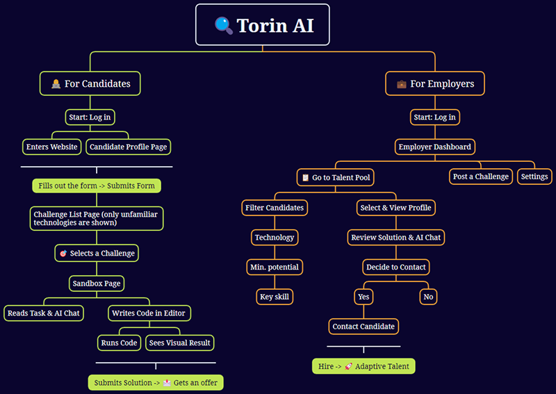

# Torin AI

An AI-powered **hiring platform** tackling unemployment and inequality in the IT labor market.  
Instead of filtering candidates by outdated CVs, it evaluates real-world problem-solving, **learning speed**, and adaptability — giving self-taught developers, career switchers, and underrepresented talent a fair **chance**.

Working prototype launched at the [**Tech Innovation For Good**](https://devpost.com/software/torin-ai) hackathon, Torin AI is built to create meaningful social impact.

## 🎯 The Problem

Traditional hiring filters out brilliant candidates without “perfect” CVs.
-   Self-taught developers, bootcamp grads, and switchers rarely pass initial screenings.
-   Companies waste countless hours on CV-based recruiting, only to discover gaps in practical skills.
-   This fuels inequality and slows innovation.

## 💡 Solution

Torin AI shifts the focus from past experience to **future potential**:
-   **Candidates** prove adaptability by solving coding challenges in unfamiliar technologies, guided by an AI assistant.
-   **Employers** access a transparent talent pool, with full visibility into the candidate’s thought process, learning curve, and problem-solving skills.
-   The result: a fair, objective, and efficient hiring environment.

## 🌍 Social Impact

-   **Educational equity:** Opens doors for candidates from non-traditional backgrounds.
-   **Economic empowerment:** Creates career opportunities for young professionals worldwide.
-   **Unlocking hidden talent:** Helps companies hire adaptive, future-proof employees who would otherwise be overlooked.

## 🖍️ Visual Concept



## ✨ Key Features

- **Skills-Based Challenges:** Candidates prove adaptability by solving tasks in unfamiliar technologies.

- **AI-Powered Thought Process Analysis:** Employers see how candidates think and learn, not just the final code.

- **Talent Pool Dashboard:** A clear, data-driven view to filter, compare, and select top talent.

- **Objective Metrics:** Evaluation across Potential Index, Learning Speed, and Code Quality for fair comparison.

- **Bias-Free by Design:** Removing CVs from screening ensures equal opportunity for every candidate.

## 🛠️ Tech Stack

* **Framework:** React with Vite
* **Routing:** React Router
* **Styling:** Tailwind CSS
* **UI Components:** Mantine UI & Headless UI
* **Icons:** Lucide React & Heroicons
* **Code Editor:** Sandpack (from CodeSandbox)

## 🚀 Getting Started

### Prerequisites
- [Node.js](https://nodejs.org/) (v18+ recommended)
- npm or yarn

### Installation
```bash  
# clone repo  
git clone https://github.com/vero-code/torin-ai.git  
cd torin-ai  
  
# install deps  
npm install  
```  

#### Run locally
```bash  
npm run dev
```  
Then open [http://localhost:5173](http://localhost:5173) in your browser.

#### Build for production
```bash  
npm run build
npm run preview
```  

## 🤝 Contributing

Pull requests are welcome! For major changes, please open an issue first to discuss what you would like to change.

## 📄 License

This project is licensed under the MIT License - see the `LICENSE` file for details.